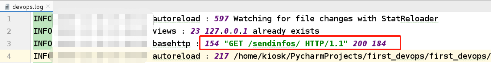

# 项目实战:  基于Ansible的云平台自动化运维系统

## 项目介绍

本项目通过KVM虚拟化搭建Linux系统集群，使用 Ansible实现Linux集群下的批量部署与自动化管理， 实现Web形式的自动化运维系统,集中批量控制服务器, 最终实现能支撑1000台实例的环境提供管理和自动化任务， 提高运维工程师的工作质量和效率。 项目基于HTTP实现自动化任务接受和响应接口设计， 基于MySQL用作的关系型数据存取， 基于Redis的任务锁机制和消息队列， 基于MongoDB的事件日志记录， 最终实现邮件通知功能、敏感数据加密功能、日志事件记录功能。


## 项目背景

### 互联网快速发展

- 网站用户规模、使用快速上升
- 要求庞大系统支撑能力
- 更加快速的运维效率应对突发流量
- 更加自动化的方式减少人工投入成本
- 更加可靠的技术手段，保障系统的稳定

### 云时代

- 腾讯云、阿里云、亚马逊云、青云等云厂商的市场份额不断增加
- 大部分技术架构设计不再以网络设计、IDC和系统硬件等方面作为重点
- 运维基础的、繁琐的工作逐步减少
- 小公司也不再需要一个运维工程师或者系统工程师

结论: 在这样的时代背景下， 大型互联网公司为了应对市场的快速变化，就需要运维自动化。

## 项目准备


### 运维自动化难点和痛点

- 开发人员： 没有系统管理、网络管理等相关运维工作经验，项目设计往往是大打折扣的。
- 运维人员: 不具备开发能力、没有项目的开发经验或能力
- 做好一个优秀的运维开发人员DevOPS = 运维能力 + 开发能力

本次项目实战就是用最短的时间、手把手地完成运维开发系统的开发实战。

### 项目技术难点

- 基本技能
  - DevOPS构建之路
  - Python基础语法
  - Django框架
- 自动化资产扫描发现
  - 资产扫描的作用
  - nmap的作用
  - telnetlib端口扫描
  - pexpect登录探测
  - paramiko登录探测
  - Docker容器扫描
  - KVM虚拟机扫描
  - snmp网络设备扫描
  - SDK调用扫描ESXI资产信息
- Ansible自动化任务
  - Ansible的安装与配置
  - Python与Ansible的操作
  - Ansible adhoc
  - Ansible playbook
  - 核心类调用
  - API 接口的封装
  - 方法的改写
  - Redis消息存储
  - Mongo事件日志

### 项目功能演示

- 资产自动化扫描

  


​		


### 整体工程设计

#### 资产的自动化扫描发现

用Python程序扫描发现企业内部的所有资产，当资产出现变动时能自动及时的发现并完成资产变更(eg: 服务器IP变更、机器集体报废)。


#### Ansible的自动化任务执行

用Ansible的ad-hoc和playbook实现批量主机的自动化任务。


### 项目环境搭建

#### 项目环境要求


- Python解释器:  3.x
- Django框架: 2.2.5
- IDE编辑器工具Pycharm: 不限制
- 自动化运维工具Ansible: 2.x
- 关系型数据库MySQL/Mariadb: 5.5.x
- [高性能的key-value非关系型数据库 Redis 软件下载](https://redis.io/): 5.0.5
- [分布式文件存储数据库 MongoDB 软件下载](https://repo.mongodb.org/yum/redhat/7Server/mongodb-org/4.2/x86_64/RPMS/)： 4.2.4
- Git工具与Github代码仓库: 不限制

#### MySQL数据库配置

- 管理数据库服务

```bash
[root@foundation0 ~]# systemctl start mariadb
[root@foundation0 ~]# systemctl enable mariadb
```

- 用户授权

```bash
[root@foundation0 ~]# mysql -uroot -p
Server version: 5.5.52-MariaDB MariaDB Server
# 新建用户
MariaDB [(none)]> create user devops@'%' identified by 'westos';
Query OK, 0 rows affected (0.03 sec)
# 创建数据库
MariaDB [(none)]> create database if not exists devopsProject default charset utf8;
Query OK, 1 row affected (0.01 sec)
# 用户授权
MariaDB [(none)]> grant all on devopsProject.* to  devops@'%'  identified by 'westos';
Query OK, 0 rows affected (0.00 sec)

MariaDB [(none)]> Bye
```

-  测试用户授权是否成功

```bash
[root@foundation0 ~]# mysql -udevops -pwestos
Server version: 5.5.52-MariaDB MariaDB Server

MariaDB [(none)]> show databases;
+--------------------+
| Database           |
+--------------------+
| information_schema |
| devopsProject      |
+--------------------+
2 rows in set (0.01 sec)
```

### 学习方法和学习建议

- 跟着文档思路一步一步执行
- 文档中没有提到的内容和概念(过于简单的步骤会略去)， 多用百度、stackoverflow等网站查询
- 一定要动手实践， 出现问题的提问方式: 描述清楚问题、问题截图和完整的错误内容。工作中也是如此， 不能描述清楚问题所在，没有人是神仙，靠算命的技术才出来。
- 一鼓作气、再而衰、三而竭。在写项目的时候一定要有合理的规划。

## DevOPS工程快速入门和引导

- 运维模块: 了解运维的工作、Linux系统的基本操作、数据库基本管理操作、网络知识等。
- 开发模块:   本项目的重点， 掌握Python基础知识、常见数据类型、Django框架的技术模块、DevOPS项目构建模块等。

## 第一个DevOPS工程

### 项目功能

记录HTTP访问的IP及用户UA信息

### 项目开发步骤

- 创建Django工程

- 创建Django APP应用

  ```bash
   $ python manage.py  startapp scanhosts
  ```

- 文件配置settings

  ```python
  # settings.py
  
  # 1). 将新建的APP加入到项目中
  INSTALLED_APPS = [
  	......省略部分
      'django.contrib.staticfiles',
      'scanhosts', 
  ]
  
  # 2). 配置数据库: 使用mysql数据库，而不是默认的sqlite数据库。
  # DATABASES = {
  #     'default': {
  #         'ENGINE': 'django.db.backends.sqlite3',
  #         'NAME': os.path.join(BASE_DIR, 'db.sqlite3'),
  #     }
  # }
  DATABASES = {
      'default': {
          'ENGINE': 'django.db.backends.mysql',
          'NAME': 'devopsProject',	# 数据库名称
          'USER': 'devops',			# 用户名
          'PASSWORD': 'westos',		# 用户密码
          'HOST': '127.0.0.1',		# 数据库服务器所在主机名
          'PORT': '3306',				# 数据库端口
      }
  }
  
  # 3). 语言和时区的设置(根据自己项目的需求， 选择修改)
  # LANGUAGE_CODE = 'en-us'
  # TIME_ZONE = 'UTC'
  LANGUAGE_CODE = 'zh-hans'		# 语言选择中文
  TIME_ZONE = 'Asia/Shanghai'		# 时区选择亚洲/上海
  ```

- 数据库模型建模models

  

  安装数据库开发软件

  ```bash
  $ yum install mariadb-devel -y
  ```

  安装数据库连接模块(必须先安装mariadb-devel， 否则会报错)

  ```bash
  $ pip install mysqlclient
  ```

  编辑数据库模型文件:

  ```python
  # models.py  
  """
  - 一个类对应一个数据库表；
  - 类的一个属性对应数据库表的一个表头；
      - max_length: 字符串最大长度， 对应数据库的varchar类型
      - default: 指定默认值
      - verbose_name: 指定Django后台显示的列头信息
      - auto_now： 每次修改记录时自动更新为当前时间
  
  - Meta类的设置
  	- verbose_name： 指定Django后台显示的表名称单数
  	- verbose_name_plural： 指定Django后台显示的表名称复数
  	- db_table: 指定数据库表的名称， 默认是APP名称_类名称.
  """
  
  
  class UserIPInfo(models.Model):
      ip = models.CharField(max_length=150, default='', verbose_name='IP地址')
      time = models.DateTimeField(verbose_name='更新时间', auto_now=True)
  
      class Meta:
          verbose_name = '用户访问地址信息表'
          verbose_name_plural = verbose_name
          db_table = 'user_IP_info'
  
  
  class BrowseInfo(models.Model):
      # null=True: 是针对数据库而言，True表示数据库的该字段可以为空。
      user_agent = models.CharField(max_length=100, default='',
                                    verbose_name='用户浏览器信息', null=True)
      disk_id = models.CharField(max_length=256, default='', verbose_name='唯一设备ID')
      """
      ForeignKey是一种关联字段，将两张表进行关联的方式
      on_delete: 是否级联删除, Django1.x默认级联删除， Django2.x必须手动指定
      on_delete有CASCADE、PROTECT、SET_NULL、SET_DEFAULT、SET()五个可选择的值
          CASCADE：此值设置，是级联删除。
          PROTECT：此值设置，是会报完整性错误。
          SET_NULL：此值设置，会把外键设置为null，前提是允许为null。
          SET_DEFAULT：此值设置，会把设置为外键的默认值。
          SET()：此值设置，会调用外面的值，可以是一个函数。
      """
      user_ip = models.ForeignKey('UserIPInfo', on_delete=models.DO_NOTHING)
  
      class Meta:
          verbose_name = '用户浏览器信息表'
          verbose_name_plural = verbose_name
          db_table = 'browse_info'
  ```

  根据ORM(对象关系映射)将面向对象形式的模型进行迁移， 生成中间代码

  ```bash
  $ python manage.py  makemigrations
  
  # 代码执行效果， 生成迁移文件，所在位置: scanhosts/migrations
  Migrations for 'scanhosts':
    scanhosts/migrations/0001_initial.py
      - Create model UserIPInfo
  ```

  将生成的迁移文件转成SQL语句并执行SQL语句， 创建对应的数据库及数据库表

  ```bash
  $ python manage.py  migrate
  ```

- Django后台管理界面

  创建后台管理的超级用户

  ```bash
  $ python manage.py  createsuperuser
  Username (leave blank to use 'kiosk'): admin
  Email address: admin@qq.com
  Password: 
  Bypass password validation and create user anyway? [y/N]: y
  Superuser created successfully.
  ```

  启动Django项目,默认开启的端口是8000

  ```bash
  $ python manage.py  runserver
  Django version 2.2.5, using settings 'first_devops.settings'
  Starting development server at http://127.0.0.1:8000/
  ```

   访问项目后台管理界面, 输入超级用户名称和密码即可进入后台界面.

  


- 项目工程设计

  当用户发起HTTP请求时， Django的采集接口将HTTP请求的头部信息headers里面的IP和UA信息采集， 并存储到数据库中。 当用户想要访问采集数据时， 从数据库中读取，以界面的方式展示给用户。

  

  | 接口名称 | 接口API                         | 对应函数名   |
  | -------- | ------------------------------- | ------------ |
  | 采集接口 | http://127.0.0.1:8000/sendinfos | user_info    |
  | 信息接口 | http://127.0.0.1:8000/getinfos  | user_history |
  |          |                                 |              |
  |          |                                 |              |

- 项目开发


### 项目开发(一) 信息采集接口的实现

- url设计

  配置URL， 当用户访问http://127.0.0.1:8000/sendinfos这个网址时， 将用户请求交给user_info视图函数处理。

  ```python
  # first_devops/urls.py
  
  urlpatterns = [
      path('admin/', admin.site.urls),
      url(r'^sendinfos/$', user_infos),
  ]
  ```

- 视图函数的实现

  ```python
  # scanhosts/views.py
  
  def user_info(request):
      # request.META 是一个Python字典，包含了所有本次HTTP请求的Header信息，比如用户IP地址和用户Agent（通常是浏览器的名称和版本号）
      ip = request.META.get('REMOTE_ADDR')
      user_agent = request.META.get('HTTP_USER_AGENT')
  
      # 使用filter()方法对数据进行过滤, 返回的是列表， 列表元素是符合条件的对象。
      user_obj = UserIPInfo.objects.filter(ip=ip)
      # 如果没有找到，则新建UserIPInfo对象,并获取对象编号(为了和BrowseInfo表关联)
      if not user_obj:
          res = UserIPInfo.objects.create(ip=ip)
          user_ip_id = res.id
      else:
          user_ip_id = user_obj[0].id
      # 新建BrowseInfo对象
      BrowseInfo.objects.create(user_agent=user_agent, user_ip_id=user_ip_id)
      # 字典封装返回的数据信息
      result = {
          'STATUS': 'success',
          'INFO': 'User Info',
          'IP': ip,
          'User-Agent': user_agent
      }
  
      # 以json的方式封装返回， 下面的两种方式任选一种.
      # return  HttpResponse(json.dumps(result), content_type='application/json')
      return JsonResponse(result)
  
  ```

- 浏览器访问效果图

  可以多试试其他浏览器访问， 看看是否返回不同的结果。

  

  浏览器访问结束后， 访问MySQL数据库， 看是否将数据信息采集成功并通过ORM的方式写入数据库中。

  ```bash
  [root@foundation0 ~]# mysql -udevops -p
  Welcome to the MariaDB monitor.  Commands end with ; or \g.
  MariaDB [(none)]> use devopsProject;
  MariaDB [devopsProject]> select * from user_IP_info;
  MariaDB [devopsProject]> select * from browse_info;
  ```

  

### 项目开发(二) 信息获取接口的实现

- url设计

  配置URL， 当用户访问http://127.0.0.1:8000/getinfos这个网址时， 将用户请求交给user_history视图函数处理。

  ```python
  # first_devops/urls.py
  
  urlpatterns = [
      path('admin/', admin.site.urls),
      url(r'^sendinfos/$', user_info),
      url(r'^getinfos/$', user_history),
  ]
  ```

- 视图函数的实现

  ```python
  # scanhosts/views.py
  
  def user_history(request):
      # 获取UserIPInfo表的所有对象信息；
      ip_lists = UserIPInfo.objects.all()
      infos = {}
      # 获取每个IP访问网站浏览器的信息， 格式如下:
      """
      infos = {
          '127.0.0.1' : ['UA-1', 'ua-2'], 
          '172.25.254.1' : ['UA-1', 'ua-2'], 
      }
      """
      for item in ip_lists:
          infos[item.ip] = [b_obj.user_agent for b_obj in BrowseInfo.objects.filter(user_ip_id=item.id)]
  
      result = {
          'STATUS': 'success',
          'INFO': infos
      }
  
      return JsonResponse(result)
  ```

- 浏览器访问效果图

  

### Django项目日志管理

在编写程序过程中，很难免的会出现一些问题，程序并非按照我们预想的那样运行，这个时候我们通常会对程序进行调试，来看看到底是哪边出了问题。而程序日志是来帮助我们记录程序运行过程的帮手，善用日志的程序员也就能很快找出自己程序的问题所在从而快速解决问题。

在服务器级别的组件中都有对应的日志文件，例如MySQL、Redis、nginx、uWSGI都会在运行过程中将一些信息写到日志文件中。

Django使用python的内置模块logging来管理自己的日志， 包含四大组件: 日志记录器Loggers、日志处理器Handlers、日志过滤器Filters和日志格式化工具Formatters。


Django项目日志管理详情查看官方文档: https://docs.djangoproject.com/en/2.2/topics/logging/

- 配置日志的相关信息

```python
# first_devops/settings.py

# 日志管理的配置
LOGGING = {
    'version': 1,
    # disable_existing_loggers是否禁用已经存在的logger实例。默认值是True.
    'disable_existing_loggers': False,
    # formatters: 定义输出的日志格式。
    'formatters': {
        'verbose': {
            # 格式化属性查看资料：https://docs.python.org/3/library/logging.html#logrecord-attributes
            'format': '{levelname} {asctime} {module} : {lineno} {message}',
            # 变量的风格
            'style': '{',
            # 日期显示格式
            'datefmt': '%Y-%m-%d %H:%M:%S',
        },
    },
    # handlers定义处理器。
    'handlers': {
        'file': {
            # 日志处理级别
            'level': 'INFO',
            # 日志处理类, 详细的请查看网站: https://docs.python.org/3/library/logging.handlers.html
            'class': 'logging.FileHandler',
            # 日志处理后输出格式
            'formatter': 'verbose',
            # 记录日志的文件名, 存储在当前项目目录下的devops.log文件
            'filename': os.path.join(BASE_DIR, 'devops.log')
        },
    },
    # loggers定义logger实例。
    'loggers': {
        'django': {
            # 对应的handles对象列表
            'handlers': ['file'],
            # logger实例输出的日志级别
            'level': 'INFO',
            # 日志是否向上级传递。True 向上级传，False 不向上级传。
            'propagate': True,
        },
    }
}
```

- 写入日志

  修改视图函数的逻辑内容， 在合适的位置添加日志输出， 便于程序的测试与排错。

  


- 重新访问网页， 查看devops.log文件测试日志是否成功写入

  


### Django项目邮件告警管理

在web应用中，服务器对客户发送邮件来通知用户一些信息，可以使用邮件来实现。Django中提供了邮件接口，使我们可以快捷的建设一个邮件发送系统。通常用于发送自定义消息或者通知告警等信息(当然也可以通过短信接口或者微信接口， 便于维护人员快速响应)。


- 服务器端开启smtp协议支持(此处以QQ邮件服务器为例服务器)

  

- 客户端配置settings文件

  ```python
  # first_devops/settings.py
  
  # 邮件配置
  EMAIL_HOST = 'smtp.qq.com'
  EMAIL_HOST_USER = 'QQ邮箱'
  EMAIL_HOST_PASSWORD = '登录授权码(注意: 不是登录密码)'
  EMAIL_PORT = 465
  EMAIL_SUBJECT_PREFIX = 'Python开发社区'
  EMAIL_USE_SSL = True
  ```

- 在Django的交互式环境测试邮件是否发送成功

  ```bash
  $ python manage.py  shell
  >>> from django.core.mail import send_mail
  >>> help(send_mail)
  >>> send_mail(subject="Django邮件发送测试代码", message='邮件发送测试成功', from_email='发送人的邮箱地址', recipient_list=['接收人的邮箱地址1', '接收人的邮箱地址2'])
  1
  ```

- 查看邮箱是否收到测试邮件

  

发送邮件在很多业务场景都会适用， 为了方便操作， 将邮件发送的内容封装成一个工具， 减少开发过程中的重复操作， 提高效率。 操作如下: 

-  将项目常用的功能封装到utils模块中， 创建的项目结构，如下:

  

- 编写封装类SendMail的类

  ```python
  # first_devops/scanhosts/utils/tools.py
  
  import logging
  
  from django.core.mail import send_mail
  from datetime import datetime
  from first_devops import settings
  
  
  class SendMail(object):
      """发送邮件的封装类"""
  
      def __init__(self, subject, message, recipient_list, ):
          # 给每个邮件的标题加上当前时间， 时间格式为年月日_小时分钟秒_传入的邮件标题
          subject_time = datetime.now().strftime('%Y%m%d_%H%M%S_')
          self.recipient_list = recipient_list
          self.subject = subject_time + subject
          self.message = message
  
      def send(self):
          try:
              send_mail(
                  subject=self.subject,
                  message=self.message,
                  from_email=settings.EMAIL_HOST_USER,
                  recipient_list=self.recipient_list,
                  fail_silently=False
              )
              return True
          except Exception as e:
              logging.error(str(e))
              return False
  ```

- 在Django自带的交互式环境shell‘中进行测试

  ```bash
  $ python manage.py  shell
  >>> from scanhosts.utils.tools import SendMail
  >>> mail = SendMail('Django 测试标题', '邮件正文内容', ['976131979@qq.com'])
  >>> mail.send()
  True
  ```

- 测试效果：

  


